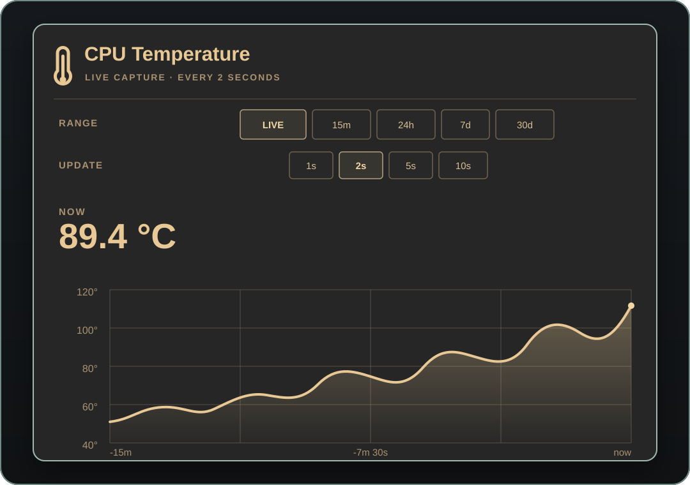

# CPU Temperature



An Omarchy Quickshell bar widget for monitoring CPU temperature. The right-side
bar button shows the current reading; click it to open a smooth, temperature-
scaled chart.

## Features

- Live capture with a selectable 1, 2, 5, or 10 second interval (2 seconds by
  default).
- A live chart whose time axis expands as the capture runs, up to 15 minutes.
- A 15-minute review, plus 24-hour, 7-day, and 30-day history views.
- Smoothed line chart, subtle area gradient, and dynamically scaled Y axis.
- Persistent local history. Regular samples are retained for up to 30 days;
  live samples are retained for up to 15 minutes.

## Requirements

- Omarchy with the Quickshell-based shell and plugin support.
- Python 3.
- A CPU temperature sensor exposed through Linux thermal zones or hwmon.

The plugin reads CPU temperature sensors under `/sys/class/thermal` and
`/sys/class/hwmon`. It does not require `lm_sensors`, network access, elevated
privileges, or a background service. Installing it with the Omarchy plugin
manager enables its widget in the bar; no manual shell configuration edits are
needed.

## Install

```sh
omarchy plugin add https://github.com/Marlon81785/omarchy-cpu-temperature.git --enable
```

The widget is added to the right section of the bar. Click its `CPU` reading to
open the chart. Choose **LIVE** to begin high-frequency capture; it continues
while the panel is closed, until another range is selected or the shell
restarts. Choose **15m** to review the captured live history. The other range
buttons show the regular history. The **UPDATE** selector changes the live
capture interval.

Temperature history is stored locally at:

```text
~/.local/state/omarchy/plugins/io.github.marlon.cpu-temperature/
```

The live history file contains only the most recent 15 minutes of samples.
Regular history is sampled while the plugin is running and is retained for up
to 30 days.

## Remove

```sh
omarchy plugin remove io.github.marlon.cpu-temperature
```

Removing the plugin does not delete its local temperature history. To remove
that data too, delete the plugin-specific state directory shown above.

## License

This project is licensed under the MIT License. See [LICENSE](LICENSE).
